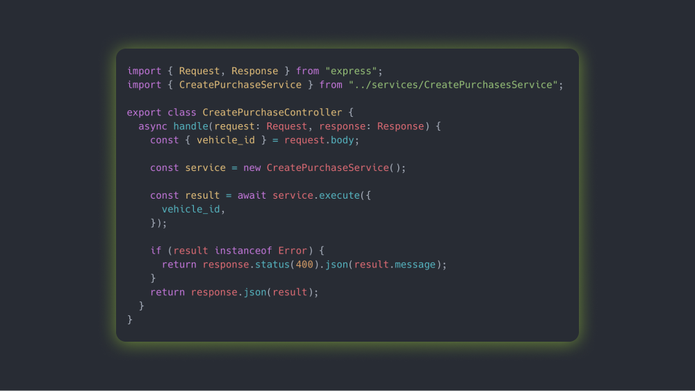

# Vehicly Agency back-end



## Stack:

- [TypeORM](https://typeorm.io//) - An ORM that can run in NodeJS, Browser, Cordova, PhoneGap, Ionic, React Native, etc.

## Project structure

```
$PROJECT_ROOT
├── src
│   ├── entity            (database models) are store
│   ├── migration         stored
│   ├── data-source.ts   configuration
│   └── index.ts          // start point of your application
├── .gitignore            // standard gitignore file
├── package.json          // node module dependencies
├── README.md             // simple readme file
└── tsconfig.json         // TypeScript compiler options
```

## Steps to run this project:

1. Run `npm i` command
2. Setup database settings inside `data-source.ts` file
3. Run `npm start` command
